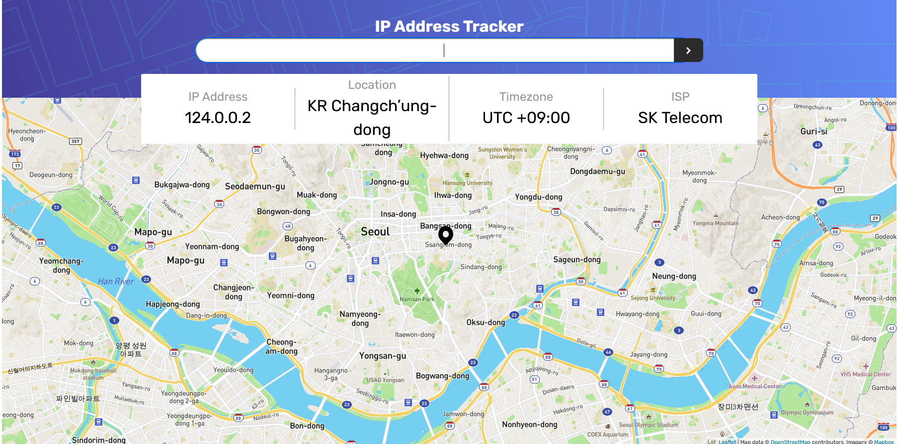
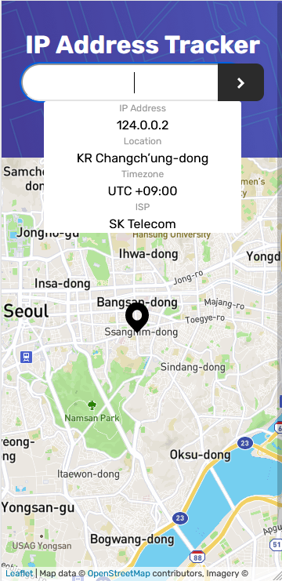

# Frontend Mentor - IP address tracker
Live demo here [ip_tracker](https://elated-hamilton-6e8ba3.netlify.app/)

Website made with js and sass, axios to fetch data from [geo.ipify](https://geo.ipify.org). Also I have a regex to validate input value before the fetch request. For the map I use leaflet [leaflet](https://leafletjs.com/). For building it I used parcel.

В этот раз был использован препроцессор sass, в дополнение к обычному js. Для запросов на сервер [geo.ipify](https://geo.ipify.org) была использована библиотека axios. Перед отправкой запрос проверялся регулярным выражением. Карты были взяты с [leaflet](https://leafletjs.com/), а для сборки проекта использовался parcel.